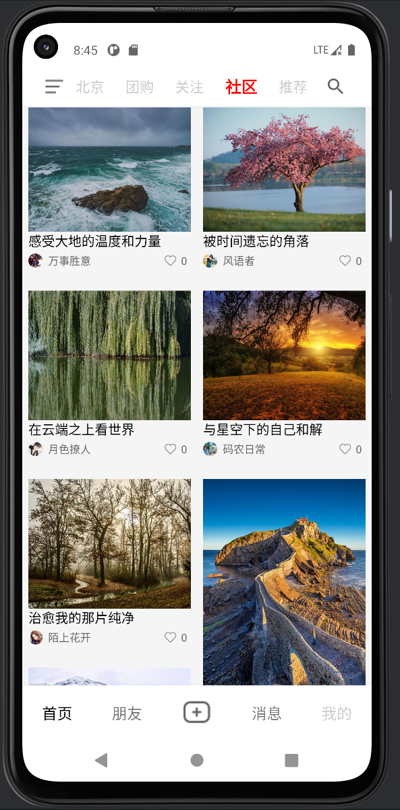
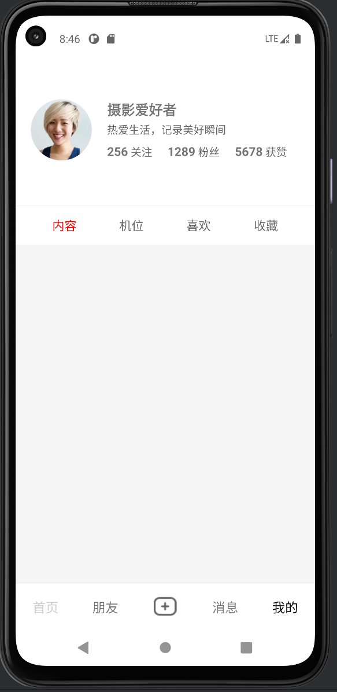
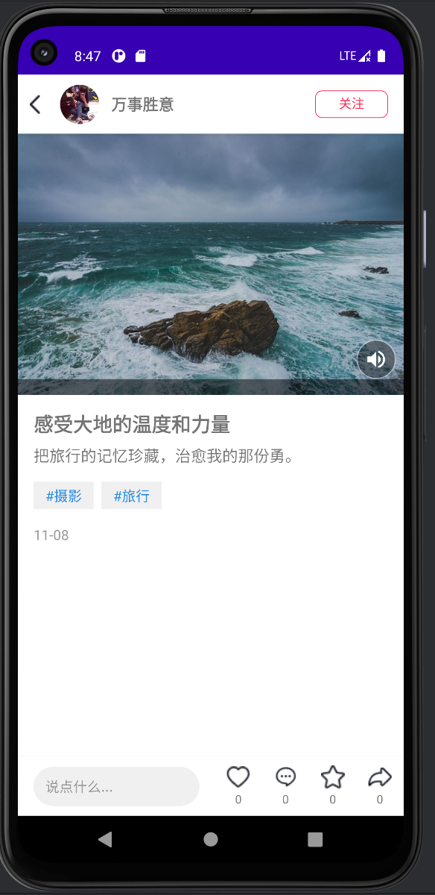

25.11-12月工程训练营-图文客户端实现过程

# 设计
```
app/src/main/java/com/example/myapplication/
├── model/ (数据模型层)
│   ├── Post.java - 帖子数据模型
│   └── PostDetail.java - 帖子详情数据模型
├── viewmodel/ (业务逻辑层)
│   ├── PostViewModel.java - 帖子列表业务逻辑
│   ├── PostDetailViewModel.java - 帖子详情业务逻辑
│   └── MineViewModel.java - 个人中心业务逻辑
├── view/ (UI展示层)
│   ├── activity/
│   │   ├── MainActivity.java - 主容器Activity
│   │   └── PostDetailActivity.java - 帖子详情页
│   └── fragment/
│       ├── HomeFragment.java - 首页Fragment
│       ├── MineFragment.java - 我的页面Fragment
│       └── PostDetailFragment.java - 帖子详情Fragment（备用）
├── repository/ (数据仓库层)
│   └── PostRepository.java - 数据获取和管理
├── adapter/ (适配器层)
│   ├── PostAdapter.java - 帖子列表适配器
│   └── ImagePagerAdapter.java - 图片轮播适配器
└── util/ (工具类)
    └── MusicPlayerManager.java - 音乐播放管理器
```
# 项目配置环境总览

🔧 **开发环境**

* IDE: Android Studio
* 构建工具: Gradle (Kotlin DSL)
* 项目类型: Android Application

☕ **Java环境**
* JDK版本: Java 11
* 源代码兼容性: Java 11
* 目标字节码: Java 11

🤖 **Android配置**
* 编译SDK版本: Android 13 (API 36)
* 目标SDK版本: Android 13 (API 36)
* 最低SDK版本: Android 7.0 (API 24)
* 应用命名空间: com.example.myapplication
* 应用ID: com.example.myapplication

🛠️ **构建工具版本**
* Android Gradle Plugin: 8.13.1

🎯 **项目特性**
* View Binding: 启用 (视图绑定功能)
* 最低兼容: Android 7.0 (Nougat)
* 目标平台: Android 13 (最新稳定版)
⚙️ 构建配置
```
kotlin
Apply
compileSdk = 36        // Android 13
minSdk = 24            // Android 7.0
targetSdk = 36         // Android 13
sourceCompatibility = JavaVersion.VERSION_11
targetCompatibility = JavaVersion.VERSION_11
```
📝 **注意事项**
* 确保Android Studio已安装并配置好最新版本。
* 安装JDK 11 或更高版本，并配置好环境变量。
* 在Android Studio中安装Android SDK Platform 36 (Android 13)。
* 确保Android Build Tools 与 compileSdk 版本兼容。
* 项目使用Gradle 8.x 构建，Android Studio会自动管理Gradle版本。

# 预览
首页展示




我的展示




详情页展示


